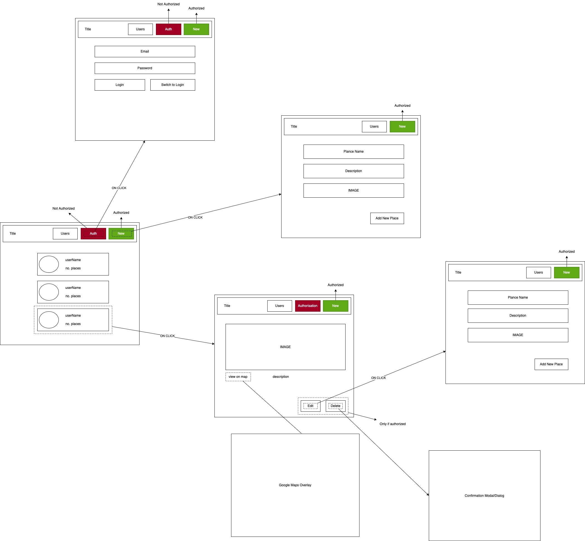
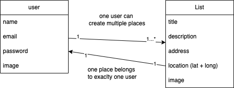

# MERN Template

## Idea / Problem to solve
- app where users can share places (with images, location, title, adn description) with other users
- as a user you can view a list of users, you can click on a user and see places the user shared
- - use all CRUD (Create, Read, Update, Delete) methods covered
- multiple data models, image upload, input validation
- authentication and authorization required

## Design / Sketch

## Plan data models
- User(s)
  - name
  - email
  - password
  - image
- Places(s)
  - tile
  - description
  - address
  - location (lat + long)
  - image

## Plan endpoints (API, backend) and pages (SPA, frontend)

### APIs
- `/api/users`
  - GET `/`
    - retrieve all users
  - POST `/signup`
    - create new user + log user
  - POST `/login`
    - log user in

- /api/places
  - GET `/user/:uid`
    - retrive list of all places for a given user (uid)
  - GET `/:pid`
    - get a specific place by place id (pid)
  - POST `/`
    - create a new place
  - PATCH `/:pid `
    - update a place id (pid)
  - DELETE `/:pid`
    delete a place by id (pid)

### Pages
- `/` -> list of users **(always reachable)**
- `/:uid/places` - list of places for selected user **(always reachable)**
- `/authenticate` - signup & login form **(only un-authenticated)**
- `/places/new` - new place form **(only authenticated)**
- `/places/:pid` - update place form **(only authenticated)**