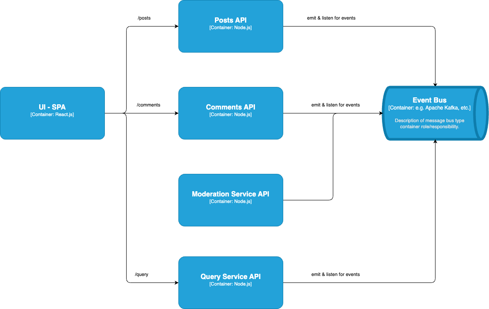

# Blog w. Comments
> course: Microservices with Node.js and React.js

## Services
| Service  | Feature           | Description                           |
| -------- | ----------------- | ------------------------------------- |
| Posts    | Create post       | Create a new blog post                |
| Posts    | List all posts    | List all existing posts               |
| Comments | Create comment    | Create a new comment and link to post |
| Comments | List all comments | List all comments related to post     |

## API Design
### Posts
| Method | Route | Description | Request | Response |
| ------ | ----- | ----------- | ------- | -------- |
| GET    | /     | List posts  |         | Posts[]  |
| POST   | /     | Create post | Post    | Post     |

### Comments
| Method | Route | Description    | Request | Response   |
| ------ | ----- | -------------- | ------- | ---------- |
| GET    | /:pid | List comments  |         | Comments[] |
| POST   | /:pid | Create comment | Comment | Comment    |

## Designs
### Init Setup

- problem: on each GET /posts request, we need to make a GET /comments request for each post -> this is not efficient

### Solution 1 - Sync Communication

Notes on Sync Communication:
| Pros               | Cons                                                           |
| ------------------ | -------------------------------------------------------------- |
| Easy to implement  | Introduces a dependency between services                       |
| Easy to understand | If any inter-service request fails, the entire operation fails |
|                    | The entire request is only as fast as the slowest request      |
|                    | Can easily introduce webs of requests                          |

### Solution 2 - Async Communication

Notes on Async Communication:
| Pros                                                      | Cons                 |
| --------------------------------------------------------- | -------------------- |
| Query Service API has zero dependencies on other services | Data duplication     |
| Query Service API will be extremely fats                  | Harder to understand |

### Moderation Feature

#### Solution 1
> Moderation API communicates event creation to Query Service API

> Problem -> if a human moderator is slow, the user will not see the comment immediately as it is not yet moderated.

#### Solution 2
> Moderation API updates status at both comments and query services

- Query Service API:
  - will have to update the status of the comment
  - will instantly show the comment to the user, but with a status of 'pending'

> Problem:
> - Query Service would have to handle CommentModerated event, this is ok for onw event, but what if we have more events to handle? (Eg. CommentModerated, CommentUpdated, CommentDeleted, CommentDownvoted, CommentUpvoted, CommentReported, etc.) - each event would have a very precise business logic to handle
> - Adding other services (Eg. Weekly Update Service, Recommendation Service, etc.) would mean duplication of code in Query Service API to other services - this is not scalable

#### Solution 3
> Query Service API only listens for 'update' events

- the Comments API will be the only service that will know how to process this very specialized update to what a comment is
- Query Service API will only know that a comment has been updated, but it will not know what the update is about