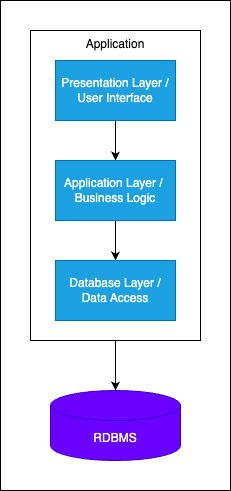
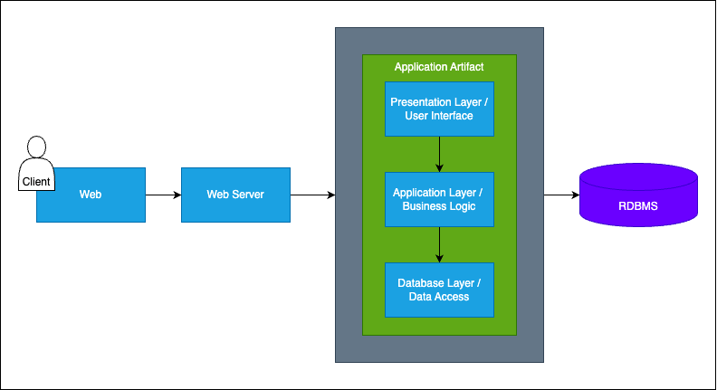

# Architecture Design Journey: v2 - v3
1. **Problem**
   - identify clearly
2. **Learn**
   - architecture approaches
   - architectural and design patterns
   - principles and best practices
3. **Design**
   - fill Design Toolbox with new knowledge
   - design initial version 
4. **Adapt**
   - apply software tools
   - implement application frameworks
   - add databases
5. **Evaluate**
   - what is wrong with this architecture?
   - how can we improve the current design?

## V3
### Problem: Code Became Too Complex Over Time
#### Understand the problem
**Problems:**
- codebase becomes too complex over time
- codebase becomes hard to understand
- refactoring and reorganization needs appears and increase the technical debt

**Solutions:**
- separate UI, Business and Data Layers as logical layers
- implement Layered Architecture
- follow SOLID OOP Design Principle

### Learn: Layered (N-Layer) Architecture
- it is the most commonly used architecture pattern - known as the n-tier architecture style or the multi-layered architecture style
- it organizes the components of an application with similar functionalities into horizontal logical layers - each layer performs a specific role within the application
- we continue to use the Monolithic Architecture, but we separate the horizontal logical layers - components are interconnected but do not depend on each other
- this architecture is about organizing the code for Separation of Concerns
- it implements Layers of Isolation so that the layers can be modified and the change won't affect other layers

**Components of a Layered Architecture**
- Presentational Layer
  - responsible for the user interactions with the software system, for example a web application
- Application / Business Layer
  - handles aspects related to accomplishing functional requirements including use-case implementations
- Database Layer
  - responsible for handling data, database, such as a SQL database

#### Separation of Concerns (SoC)
- core software design principle
- design principle for separating a computer program into a distinct sections
- it promotes the isolation of the applications into separate sections - helps manage complexity by partitioning the software system
- it helps distinguish between the concepts of layer and tiers with certain responsibilities
- elements in the software should be unique
- the SoC principle limits to allocate responsibilities
- the SoC promotes low-coupling, high-cohesion

#### SOLID
1. Single Responsibility Principle
   - each of your components or modules should be responsible for only one feature
2. Open/Closed Principle
   - whe we design the system, it should be able to extend without changing existing architecture
3. Liskov's Substitution Principle
   - systems can be substitute each other easily - in out case we can use plug-in services that we can shift them easily
4. Interface Segregation Principle
   - states tha no code should be forced to depend on methods it does not use
5. Dependency Inversion Principle
   - states that high level modules should not depend on low-level modules, both should depend on abstractions

### Design: Toolbox
Architectures:
- v2: Monolithic Architecture
- v3: **Layered Architecture (as sub-arch. style of Monolithic Architecture)**

Patterns and Principles
- v2: DRY
- v2: KISS
- v2: YAGNI
- v3: **Separation of Concerns (SoC)**
- v3: **SOLID Principles**

Non-Functional Requirements (Non-FR)
- v2: availability
- v2: small number of concurrent users
- v3: **maintainability**

Functional Requirements (FR)
- v1: list products
- v1: filter products as per brand and categories
- v1: put products into the shopping cart
- v1: apply coupon for discounts and see the total cost all for all of items in shopping cart
- v1: checkout the shopping cart and create order
- v1: list my old orders and order items history

### Adapt: Technology Stack

| Java                     | .NET           | JavaScript |
| ------------------------ | -------------- | ---------- |
| Apache TomCat Web Server | IIS Web Server | Node.js    |
| J2EE                     | ASP .Net       | Express.js |
| MySQL                    | SQL Server     | SQL Server |

### Evaluate: Layered Monolithic Architecture
Benefits:
- easy development, debug and deployment
- horizontal logical layers
- separation of concerns

Drawbacks:
- layers depend on each other
- high level of coupling
- hard to maintain
- complex codebase
- hard to change libraries - Eg. to change ORM tool with different library required to modify the business layer