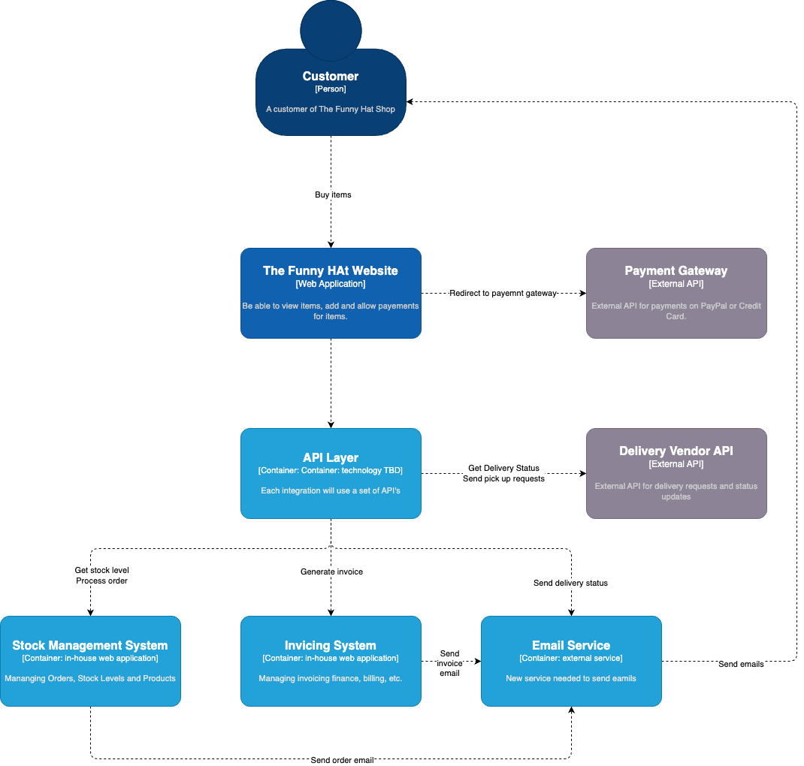
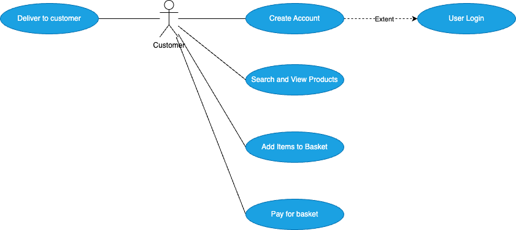

# Software Architecture Document

## Project Description
The purpose of this project is to develop an e-commerce web application for The Funny Hat Shop. The project includes building a solution architecture according to the IT architecture vision and business requirements.

The business outcome is to drive additional sales by implementing an e-commerce web site to sell its products online The web site should be easy to use, but fast and friendly to use on any channel, such as mobile phones, tablets and personal computers.

The Funny Hat Shop made an agreement with an external Vendor for deliveries of the products to the customers. The solution needs to integrate with the delivery companies API’s.

## In-Scope
The following architecture building blocks are in scope of this project:
● Create an e-commerce web application hosting on the AWS platform
● Integration with the stock management and invoicing systems
● Stand up a e-mail service to communicate to customer
● Work with a new Delivery Vendor to pick up and deliver products sold on the web site
● Integrate with the Delivery Vendor API to automate status updates anddelivery requests
● Add images to the stock management system for each product

## Out of Scope
Upgrading the stock management system is not in scope of this project. The stock management system will be hosted on Amazon AWS with an API capability to access and update stock levels.

## Business Architecture: Capability Map

## Application Impacted
| Business capability | Application/System               | N=Buy/Build/Reuse | Application Roadmap |
| ------------------- | -------------------------------- | ----------------- | ------------------- |
| online sales        | e-commerce web application       | build             | new                 |
| customer accounts   | crm database                     | build             | new                 |
| customer insights   | BI reporting system              | build             | new                 |
| order management    | stock management system          | reuse             | change              |
| product management  | stock management system          | reuse             | change              |
| delivery service    | external vendor - funny delivery | buy               | new                 |
| invoicing           | stock management system          | reuse             | change              |
| communication       | AWS SES service                  | build             | new                 |
| it support          | AWS CloudWatch                   | build             | new                 |

## AS-IS Context Diagram
No As-Is context diagram is available.

## TO-BE Context Diagram

## Use Case View

## Non-Functinoal Requirements
### Availability
| Requirement               | Description                                                                                                                                                                                                                          | Answer                                                                                 |
| ------------------------- | ------------------------------------------------------------------------------------------------------------------------------------------------------------------------------------------------------------------------------------ | -------------------------------------------------------------------------------------- |
| Hours of Operation        | Describe hours of operation for the solution. Eg. 24x7 or weekdays only between 9am and 5pm                                                                                                                                          | 24x7                                                                                   |
| Availability %            | Percentage of time that the application, process or capability needs to be available (Eg. 99.9%)                                                                                                                                     | 99.9%                                                                                  |
| SLA                       | Service Level Agreement as measured by time (E.g. 30 minutes for completion of the process or batch). If external interfaces are part of the solution, provide the SLA for these individual interfaces (E.g. file delivered by 2 AM) | Deliver emails to customers not more than 10 minutes after order placed                |
| Maintenance/Upgrade Time  | When do you plan for upgrades on the system? Define a maintenance window (E.g. Sundays from 1:00 AM – 4:00 AM)                                                                                                                       | Planned downtime for Monday mornings 1 to 2 hours only at 1am                          |
| Unplanned Downtime Impact | Describe the impact of any unplanned downtime on the business or process                                                                                                                                                             | Sales will be impacted if the system is down for more than 1 hour                      |
| Batch Processing Time     | Define any batch process time windows (Eg. batches can only be run between 2am and 4am)                                                                                                                                              | Batches are expected to run to check delivery status. This should run every 10 minutes |

### Performance
| Requirement   | Description                                                                                                                                                                                                       | Answer                                                                  |
| ------------- | ----------------------------------------------------------------------------------------------------------------------------------------------------------------------------------------------------------------- | ----------------------------------------------------------------------- |
| Response Time | Measurement in time of the response of the system, to include the average expected response time and the maximum acceptable response time. This can either be the screen response time (E.g. Less than 2 seconds) | - Website response time less than 2 seconds                             |
|               |                                                                                                                                                                                                                   | - Allow for a thousand hit per day                                      |
|               |                                                                                                                                                                                                                   | - Solution should allowed for auto scalability on evenings and weekends |
| Data Latency  | Define the acceptable data latency of data required for the Solution. E.g. customer address can be a maximum of 1 day.                                                                                            | - Stock levels should be updated in real-time                           |
|               |                                                                                                                                                                                                                   | - No Latency expected                                                   |

### Volumes
| Requirement                 | Description                                                                                                                                                                    | Answer                                                                                                            |
| --------------------------- | ------------------------------------------------------------------------------------------------------------------------------------------------------------------------------ | ----------------------------------------------------------------------------------------------------------------- |
| Average Volume Estimates    | Measure of the average volume of the solution over a period of time such as daily or monthly (E.g. 1000 transactions per day)                                                  | 500 transactions per month, but website can be hit 1000 times per day                                             |
| Peak Estimates              | Define the peak time period for high volumes of data. (E.g. end of  the month) Also define a peak time time period during a day or week (E.g. Between 5pm and 8pm or weekends) | Peak times expected in the evenings and weekends                                                                  |
| File Sizes & Interface Type | Size in gigabytes, megabytes or kilobytes of any files that is required for processing (E.g. interface size on a web services, image files or any other document files, etc.)  | Product images are stored on AWS S3 Buckets for the stock management. Images are about 50kb average               |
| Backups / Archiving         | Describe the percentage of data that needs to be either purged or archived, and define the percentage over time. Also indicate when and how backups should be taken.           | The solution should include replication for the database. Daily backups using AWS Backup top the AWS RDS database |
| History                     | Describe how long you need to keep data history. E.g. the solution needs 2 years of history for online transactional data                                                      | Keep sales for 10 Years                                                                                           |
| Database Growth Projections | Indication of the percentage increase or decrease of the size of the database over time. E.g. 5% increase over the first 12 months                                             | 10% growth expected after 12 months                                                                               |
### User Interactions
| Requirement | Description | Answer |
| ----------- | ----------- | ------ |

### Business Continuity
| Requirement | Description | Answer |
| ----------- | ----------- | ------ |

### Security
| Requirement | Description | Answer |
| ----------- | ----------- | ------ |

### Operations Monitoring
| Requirement | Description | Answer |
| ----------- | ----------- | ------ |

### Networking
| Requirement | Description | Answer |
| ----------- | ----------- | ------ |

### User Interface Requirements
| Requirement | Description | Answer |
| ----------- | ----------- | ------ |

### Architecture Requirements
| Requirement | Description | Answer |
| ----------- | ----------- | ------ |