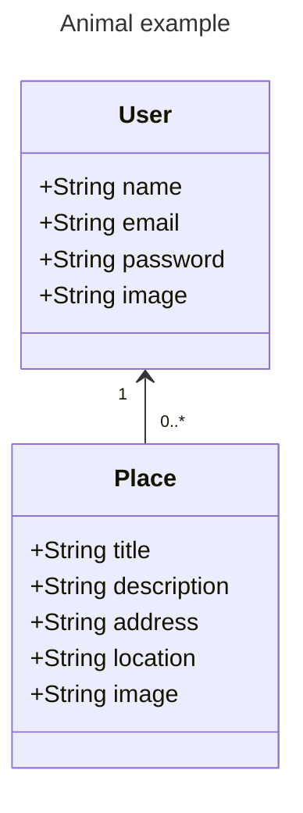

# Spot Share
## Application Data

## API Endpoints
### `/api/users/...`
| Method | Endpoint | Description                  |
|--------|----------|------------------------------|
| GET    | `/`      | Retrieve / Get all users     |
| POST   | `/signup`| Create a new user            |
| POST   | `/login` | Login a user                 |

### `/api/places/...`
| Method | Endpoint    | Description                                               |
|--------|-------------|-----------------------------------------------------------|
| GET    | `/user/:id` | Retrieve a list of all places for a given user id (uid)   |
| POST   | `/:pid`     | Get a specific place by id (pid)                          |
| POST   | `/`         | Create a new place                                        |
| PATCH  | `/:pid`     | Update a place by id (pid)                                |
| DELETE | `/:pid`     | Delete a place by id (pid)                                |

## SPA Pages
| Path            | Page         | Description                                     | Access                                        |
|-----------------|--------------|-------------------------------------------------|-----------------------------------------------|
| `/`             | Home         | List of users                                   | (Public) always reachable                     |
| `/:uid/places`  | Places       | List of places for a given user id (uid)        | (Public) always reachable                     |
| `/auth`         | Authenticate | Login & Signup page                             | (Public) only reachable if not authenticated  |
| `/places/new`   | New Place    | Create a new place form                         | (Private) only reachable if authenticated     |
| `/places/:pid`  | Place        | View a specific place by id (pid) & Update form | (Private) only reachable if authenticated     |

