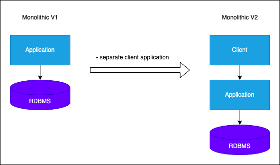

# Architecture Design Journey: PoC - v1 - v2
1. Problem
   - identify clearly
2. Learn
   - architecture approaches
   - architectural and design patterns
   - principles and best practices
3. Design
   - fill Design Toolbox with new knowledge
   - design initial version 
4. Adapt
   - apply software tools
   - implement application frameworks
   - add databases
5. Evaluate
   - what is wrong with this architecture?
   - how can we improve the current design?
  
## v1 & v2
### Problem: Sell Products Online
- create e-commerce web application
- identify use-cases and non-functional requirements
- list products, add basket/cart and ordering products
- available 7/24
- handle good amount of requests per second
- provide acceptable latency for users

#### Understand the problem
- understand the e-commerce domain
- functional and non-functional requirements
- use cases

### Learn: E-Commerce Domain
- Understand domain and decompose in small pieces
  - use cases
  - functional requirements

#### Identify steps:
- requirements and modeling
- identify user stories
- identify the nouns in te user stories
- identify the verbs in the user stories

#### Functional Requirements
- list products
- filter products as per brand and categories
- put products into the shopping cart
- apply coupon for discounts and see the total cost all for all of items in shopping cart
- checkout the shopping cart and create order
- list my old orders and order items history

##### User Stories
- as a user I want to list products
- as a user I want to filter products as per brand and categories
- as a user I want to put products into the shopping cart so that I can check out quickly later
- as a user I want to apply coupon for discounts and see the total cost all for all items that are in my cart
- as a user I want to checkout the shopping cart and create an order
- as a user I want to list muy old orders and order items history
- as a user I want to login system as a user and the system should remember my shopping cart items

#### Non-Functional Requirements (the *-ilities)
- Scalability
- Availability
- Reliability
- Maintainability
- Usability
- Efficiency

#### Monolithic Architecture & Design Principles
##### What is Monolithic Architecture?
- traditional approach to software development and architectureal pattern of designing and developing complete applications as a single unit
- in monolithic applications the UI, Business Logic and Database calls are in the same codebase

##### When to use Monolithic Architecture?
##### Benefits & Challenges of Monolithic Architecture

### Design: Toolbox
Architectures:
- Monolithic Architecture

Patterns and Principles
- DRY
- KISS
- YAGNI

Non-Functional Requirements (Non-FR)
- availability
- small number of concurrent users

Functional Requirements (FR)
- list products
- filter products as per brand and categories
- put products into the shopping cart
- apply coupon for discounts and see the total cost all for all of items in shopping cart
- checkout the shopping cart and create order
- list my old orders and order items history

#### Adapt: V1 to V2
- add database
- separate client application
  

### Evaluate: V2 Monolithic Architecture of E-Commerce App.
Benefits:
- easy development process
- easy to debug and test
- easy to deploy

Drawbacks:
- highly & tight coupling between internal components
- hard to split code
- it violates Separation of Concerns principle
- dependencies are interlocked without layers of isolation

