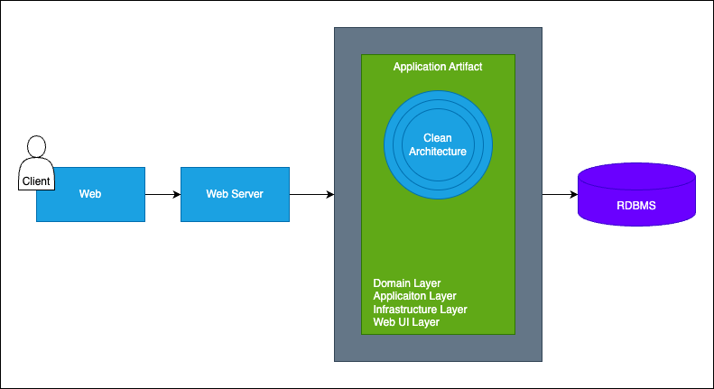
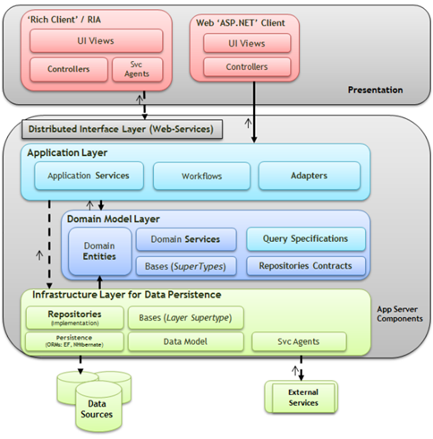

# Architecture Design Journey: v2 - v3
1. **Problem**
   - identify clearly
2. **Learn**
   - architecture approaches
   - architectural and design patterns
   - principles and best practices
3. **Design**
   - fill Design Toolbox with new knowledge
   - design initial version 
4. **Adapt**
   - apply software tools
   - implement application frameworks
   - add databases
5. **Evaluate**
   - what is wrong with this architecture?
   - how can we improve the current design?

## V3
### Problem: High level of coupling and dependent layers
#### Understand the problem
Problems:
- layers are highly coupled and depend on each other
- code organization is hard to maintain
- locking of frameworks that are hard to change

Solution
- Clean Architecture
- The Dependency Rule

Add New Non-Functional Requirements
- for Layered Architecture -> Maintainability
- for Clean Architecture -> Flexibility & Testability

### Learn: Clean Architecture
- separates the elements of a design into circle levels
- was created by Robert C. Martin and promoted on his blog
- it helps organize code and encapsulate the business logic
- it promotes keeping the core business logic and application domain ar the center of the solution structure that is independent of presentation and data access layers
- Clean Architecture is divided into two main elements:
  - Policies: the business rules and procedures
  - Details: implementation code to carry out policies
- Clean Architecture focuses on the policies and business logics that build on project requirements
  - focus on separating the concerns of an application, making it scalable, testable and maintainable
- the internal layers contains the business rules and has no dependency on any third-party library

- The layers of Clean Architecture are: Presentation Layer, Application Layer, Domain Layer, and Infrastructure Layer.
  - The Presentation Layer handles user interface and user interactions
  - The Application Layer handles business logic
  - The Domain Layer contains the core entities and business rules
  - The Infrastructure Layer contains the low-level technical details such as databases, APIs, and external services.

Clean Architecture has really good advantages to organize code and increase testability. But when it comes to adding new feature into application that written with Clean Architecture, It's hard to develop new feature that required to touch all layers, even a small changes we have to locate Domain, Application, UI and Infrastructure layers.

Clean Architecture emphasizes the importance of separating core business logic from external elements like frameworks and databases, ensuring that the core remains unaffected by external changes.

While Clean Architecture offers many benefits for scalability and maintainability, it can introduce unnecessary complexity for smaller, simpler applications.

In an eCommerce application, third-party payment integrations would typically reside in the External Interfaces or Frameworks layer as they are external agents interacting with the core application.

#### The Dependency Rule of Clean Architecture
> this is the main principle of Clean Architecture
- Rule: The dependencies of a source code can only point inwards.
  - code dependencies can only move from the outer levels inward
  - code on the inner layers can have no knowledge of functions on the outer layers
  - inner layer cannot have any information about elements of an outer layer
  - classes, functions, variables, data format, or any entity declared in an outer layer must not be mentioned by the code if an inner layer

In Clean Architecture, the Dependency Rule dictates that dependencies should always point toward the inner layers, ensuring that the core business logic remains independent of external frameworks, interfaces, and agents.

#### Layers of Clean Architecture
1. Entities
   - encapsulate 
2. Use cases
3. Interface Adapters
4. Frameworks and Drivers

#### Benefits of Clean Architecture
- Independent of Database and Frameworks
  - the software is not dependent on an ORM or Database - you can change them easily
- Independent UI
  - the UI can change easily, without changing the rest of the system and business rules
- Testable
  - it is naturally testable - you can test business rules without considering UI, Database, Mock servers
- Independent of ant external agency
  - in fact, your business rules simply do not know anything at all about the outside world

#### Resources
- [The Clean Code Blog by Robert C. Martin - The Clean Architecture](https://blog.cleancoder.com/uncle-bob/2012/08/13/the-clean-architecture.html)
- [Lewis Baxter - Understanding The clean Architecture Pattern in Software Development](https://lewisjohnbaxter.medium.com/understanding-the-clean-architecture-pattern-in-software-development-7a26a494419d)
- [freecodecamp.org - A Quick Intro to Clean Architecture](https://www.freecodecamp.org/news/a-quick-introduction-to-clean-architecture-990c014448d2/)

### Design
#### Toolbox
Architectures:
- v2: Monolithic Architecture
- v3: Layered Architecture (as sub-arch. style of Monolithic Architecture)
- v4: **Clean Architecture**

Patterns and Principles
- v2: DRY
- v2: KISS
- v2: YAGNI
- v3: Separation of Concerns (SoC)
- v3: SOLID Principles
- v4: **The Dependency Rule**

Non-Functional Requirements (Non-FR)
- v2: availability
- v2: small number of concurrent users
- v3: maintainability
- v4: **flexibility**
- v4: **testable**

Functional Requirements (FR)
- v1: list products
- v1: filter products as per brand and categories
- v1: put products into the shopping cart
- v1: apply coupon for discounts and see the total cost all for all of items in shopping cart
- v1: checkout the shopping cart and create order
- v1: list my old orders and order items history

### Evaluate: Clean Architecture
Benefits:
- easy development, debug and deploy
- loosely coupled independent layers
- flexible logical layers
- testable and independent changeable to 3rd parties libraries

Drawbacks:
- layers are independent, but it is all about technical layers
  - domain, infrastructure, application and UI layers
- vertical business logic implementation codes requires to modify all layers (Eg. add to cart, checkout order use-cases)
- it is still monolithic and has scalability issues
  - how many concurrent requests can accommodate our design?